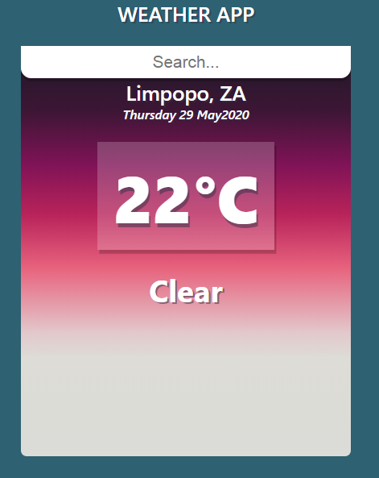
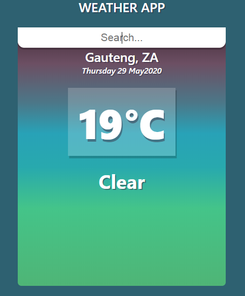

# `Weather APP`

This project was bootstrapped with [Create React App](https://github.com/facebook/create-react-app).

## `what it does`
It is frontend react-app that allow the user to search for weather to different countries. The app have a search input that allow the user to enter the country and search.

## `Built With`

- React.js,
- CSS3,
- Jsx

## `Screenshot`

## `Live Demo`
 Click [here](https://mystifying-tereshkova-9e3c32.netlify.app) for Live Demo

👤 **Author**

- Github: [@nellencr](https://github.com/nellencr)
- Twitter: [Nella](https://twitter.com/Nella75794271)
- Linkedin: [Nela Komane](https://www.linkedin.com/in/nela-komane-8866b9192/)
- Email: nellencr@gmail.com
